# Virtual Domains (VDOM)

- **Virtual Domain**
  - Domaine virtuel
    - Les VDOM sont une virtualisation au sein de FortiOS
      - Ils permettent de disposer de plusieurs pare-feux virtuels sur un équipement unique.
    - Permet de subdiviser les stratégies de sécurité en plusieurs domaines.
      - Chaque VDOM possède des politiques de sécurité et des tables de routage indépendantes.
    - Permet d'attribuer des comptes administrateurs différents pour la gestion des différents domaines
  - Chaque interface est membre d'un seul VDOM.
    - Les VDOM sont comme des périphériques indépendants
      - Par défaut, le trafic d'un VDOM ne peut pas aller vers un autre VDOM.
      - Deux interfaces dans des VDOM différents peuvent avoir la même adresse IP, sans problème de chevauchement.
    - L'interface sur laquelle un paquet arrive détermine quel VDOM traite le trafic.

# Exemples d'utilisation

- *Multi VDOM : exemple 1, VDOM indépendant*
  - 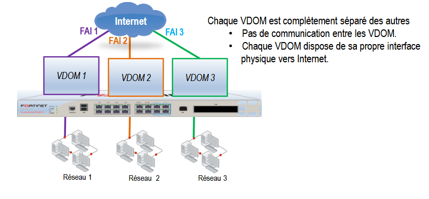

- *Multi VDOM : exemple 2*
  - 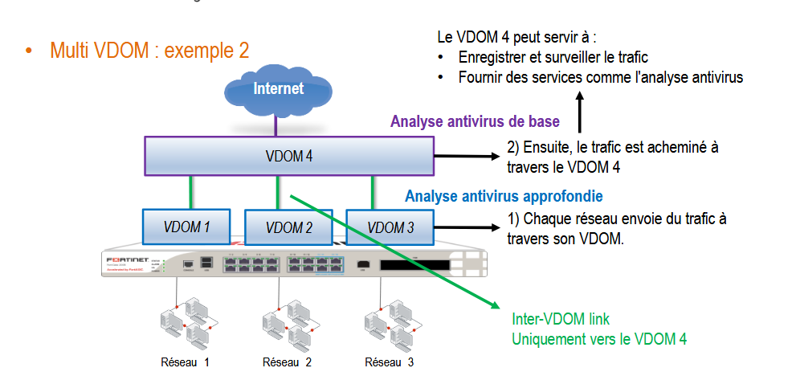

- *Multi VDOM : exemple 3, VDOM maillés*
  - 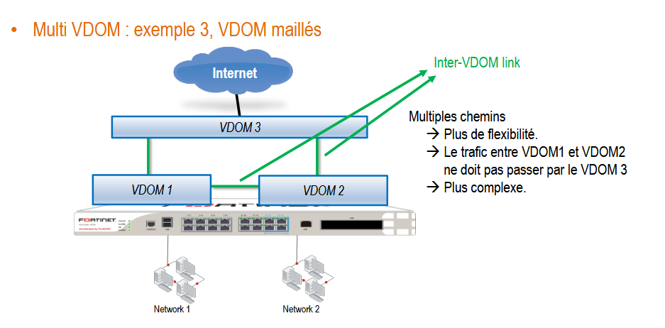
  

# VDOM Mode

- **Multi-vdom mode**
  - Possibilité de créer plusieurs VDOM agissant comme des FW indépendants.
  - Trois types de VDOM.
- 1. ***Admin VDOM* = VDOM de gestion**
  - Certains trafics proviennent du FortiGate lui-même
    - Trafic NTP, FortiGuard, SNMP, Web filtering, log, ...
  - Tout le trafic généré par le FortiGate provient du VDOM de gestion
    - Ce VDOM doit donc avoir accès à tous les services globaux dont FortiGate a besoin.
    - Ce VDOM nécessite un accès Internet pour les mises à jour.
  - Un, et un seul, des VDOM d'un FortiGate joue le rôle de VDOM de gestion.
    - Utilisé uniquement pour la gestion du pare-feu
    - Ne transfère aucun trafic d'une interface à une autre.
    - Un seul *admin VDOM* possible

# Management VDOM

- 2. **Traffic VDOM**
  - VDOM "standard", utilisé pour traiter le trafic traversant le pare-feu.
- 3. **Extension LAN VDOM**
  - Transforme le VDOM pour qu'il fonctionne comme un FortiExtender en mode extension LAN.
  - Il permet d'établir une connectivité de couche 2 via un tunnel IPsec (encapsulé en VXLAN) entre un "FortiGate Connector" et un "FortiGate Controller" distant.

- ### Admin VDOM
  - **VDOM root**
    - Par défaut, le VDOM root agit en tant que VDOM de gestion et tranfère aussi le trafic.
    - Il est possible d'assigner cette tâche à un autre VDOM.

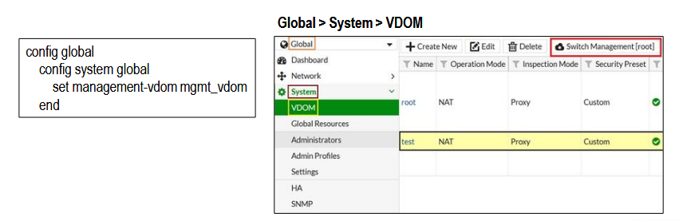

# VDOM

- ### Activer les VDOM
  - **Via le Dashboard ou en CLI**
    - Par défaut, FortiGate supporte jusqu'à 10 VDOM.
    - Certains modèles permettent l'achat de VDOM supplémentaires.
  - **Pas de reboot**
    - Le trafic passant par le FortiGate n'est pas affecté, mais l'activation des VDOM déconnectera toutes les sessions d'administration actives.
  - En CLI :
    - 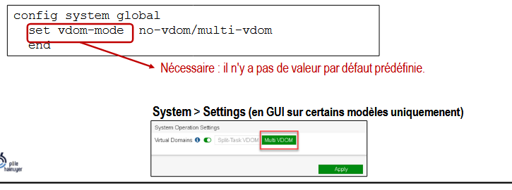

- ### Créer des VDOM
  - **Root management VDOM**
    - Par défaut, un seul VDOM existe : le VDOM root.
  - Création de VDOM (mode multi-vdom)

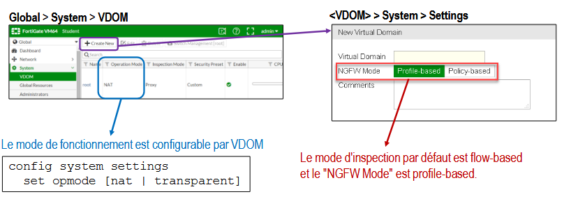

- ### Assigner une interface à un VDOM
  - **Une interface (physique ou VLAN) ne peut appartenir qu'à un seul VDOM.**

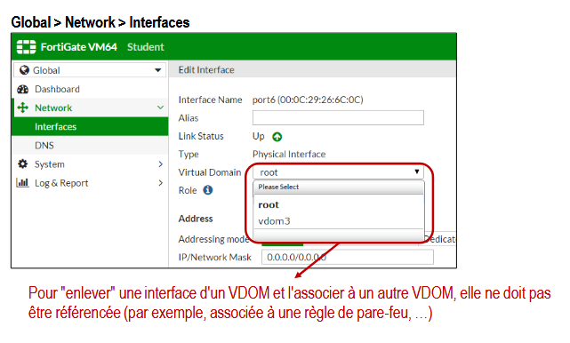

# Allocation des ressources

- ### Ressources partagées
  - **Les VDOM se partagent les ressources physiques du système**
    - Un VDOM pourrait donc monopoliser toutes les ressources.
  - **Important de fixer des limites d'utilisation des ressources.**
    - *Avantages*
      - Permet d'empêcher que les ressource ssoient monopolisées par un VDOM ou une fonctionnalité d'un VDOM.
      - Permet d'affiner l'allocation des ressources afin d'améliorer les performances.
    - *Limitation des ressources globales (Global Resources Limit)*
      - Limite les ressources allouées à chaque fonctionnalité (tunnels IPsec, objets d'adresses, etc) sur l'ensemble du FortiGate.
    - *Limitation des ressources par VDOM (VDOM Resources Limit)*
      - Limite les ressources allouées à chaque fonctionnalité de chaque VDOM.
      - Permet de garantir qu'aucun VDOM ne peut s'accaparer toutes les ressources.
      - Permet de garantir une allocation minimale de ressources par VDOM.

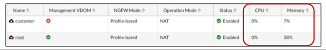

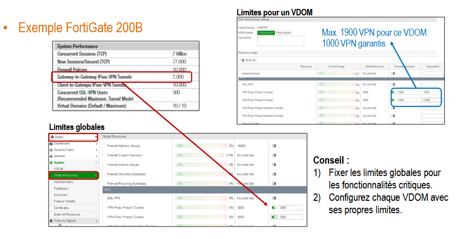

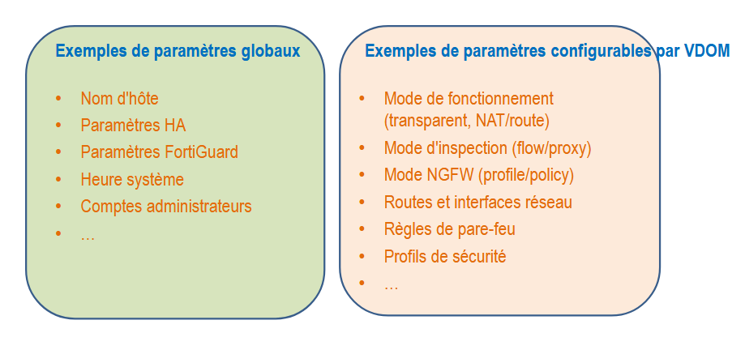

# Gestion des VDOM

- ### Accéder aux paramètres globaux et par VDOM en GUI
  - **Connexion automatique au VDOM**
    - En se connectant avec un compte administrateur, l'utilisateur est automatiquement connecté à un VDOM associé à son compte.
  - **Compte *admin* et profil *super_admin***
    - Seul un compte utilisateur avec un profil super_admin a accès à tous les VDOM et aux paramètres globaux.

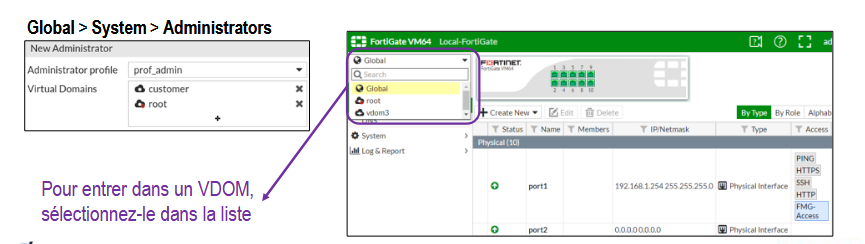

- ### Assigner un compte administrateur à un VDOM
  - /!\ Faudra créer son compte admin et l'associer à un ou plusieurs VDOM.

  - 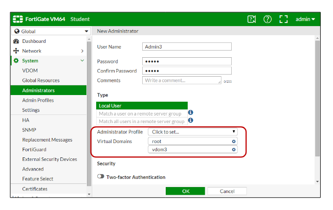

- ### Accéder aux paramètres globaux et par VDOM en CLI

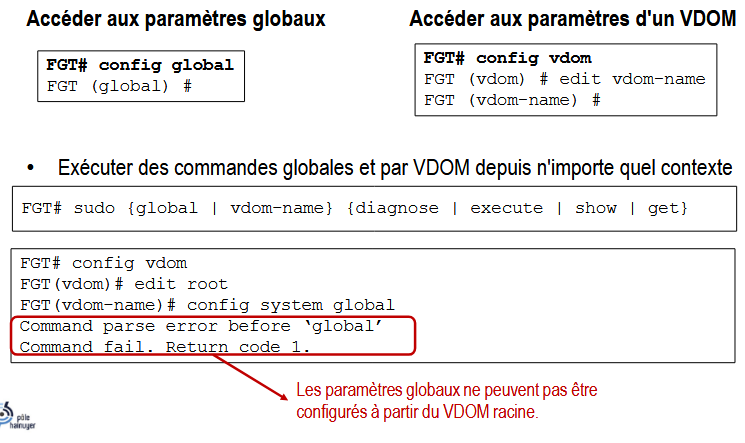

- ### Profils de sécurité globaux
  - **Le même profil de sécurité est utilisable dans plusieurs VDOM.**
    - Évite de devoir configurer le même profil dans chaque VDOM.
    - Le profil global est disponible en lecture seule pour les administrateurs du VDOM.
    - Le nom d'un profil global devrait toujours commencer par "g-".
  - **Disponibles pour les fonctions de sécurités suivantes**
    - Antivirus, contrôle d'application, IPS, filtrage Web.

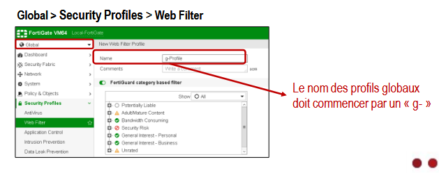

# Inter-VDOM Link

- ### Inter-VDOM links
  - **Les liens inter-VDOM sont un type d'interface virtuelle**
    - Ils permettent à des VDOM de communiquer entre eux.
    - Au moins un des VDOM doit fonctionner en mode NAT/route.
  - **Avantages**
    - Moins d'interfaces physiques et de câbles requis pour interconnecter des VDOM.
    - Le trafic n'a pas besoin de quitter une interface physique, puis d'entrer à nouveau dans le FortiGate.
  - **Routage et pare-feu**
    - Des règles de pare-feu sont nécessaires pour autoriser le trafic entrant par les liens inter-VDOM.
    - Des rotues sont également nécessaires pour acheminer le traifc d'un VDOM à un autre VDOM.

- ### Configurer une interface "VDOM link"

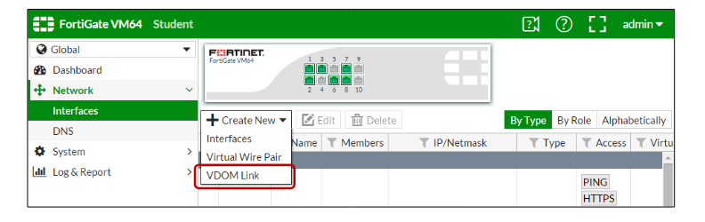

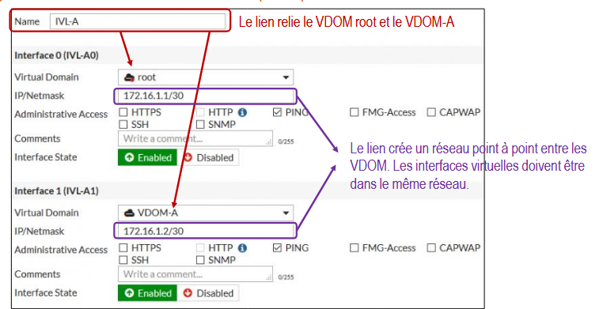

# Monitoring VDOM

- ### System > VDOM
  - **Un système de monitoring des VDOM permet d'afficher l'utilisation du CPU et de la mémoire pour chaque VDOM.**

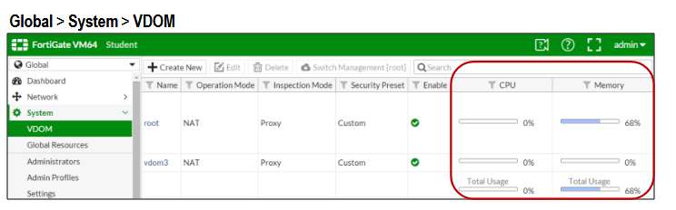

# Dépannage VDOM

- ### Problème d'accès en administrateur
  - **Point à vérifier**
    - Vérifier le compte administrateur associé au VDOM.
    - Vérifier les privilèges d'accès de l'administrateur du VDOM.
    - Vérifier les interfaces du VDOM.
    - Vérifier l'hôte et les IP de confiance (Trusted Hosts).
  - **Vérifier le routage des paquets via les bonnes interfaces**
    - ```bash 
        FGT# diagnose sniffer packet <interface_name> <'filter'> <verbose> <count>```

  - **Vérifier le flux des paquets au sein de FortiGate**
    - ```bash
        FGT# diagnose debut enable
        FGT# diagnose debug flow filter addr <PC1> 
        FGT# diagnose debug flow trace start 100```


# Chapitre 5 - NAT

- ### Rappel
  - **Translation d'adresses**
    - **SNAT -** Source Network Address Translation.
      - Nom donné à la fonction NAT/PAT qui "traduit" l'adresse source d'un paquet IP.
    - **DNAT -** Destination Network Address Translation.
      - Nom donné à la fonction NAT/PAT qui "traduit l'adresse de destination d'un paquet IP.
    - **PAT -** Port Address Translation.
      - Modification de l'adresse source et du port source dans un paquet.
      - NAT overload.
    - **NAT64, NAT46**
      - IPv4 <=> IPv6
    - **NAPT -** Network Address and Port Translation
      - Acronyme parfois utilisé pour désigner à la fois du NAT et du PAT.
___
*Commentaires du prof*

- NAT techniquement c'est de la translation d'adresses, seulement adresse IP.
- Problème sur un réseau de 150 machines, j'ai une seule adresse IP publique.
- Imaginons une machine 10.1.1.1 et l'autre 10.1.1.2, on remplacera les 2 IP par une IP publique quand ça sort. 
- Donc on l'associe à qui ? Au port.
- Il se pourrait quand même que nos 2 machines puissent utiliser le même numéro de port.
- Translation d'adresses et de port alors.
- Quand le paquet va arriver, IP par IP publique, on conserve le port
- 2e paquet, vu qu'il utilise le même port, on va remplacer IP par IP publique et le port par un autre numéro de port.
- À la fois translation d'adresses et de port, donc ***PAT***.
- NATER entre IPv4 et IPv6, pour que les 2 communiquent faudra transformer les adresses IPv4 en IPv6 et vice-versa.
___

- **Avantages principaux du NAT**
  - Assure la cohérence des chémas d'adressage du réseau interne.
  - Permet d'économiser les adresses publiques.
  - Améliore la sécurité en empêchant de connaître les adresses utilisées en interne.

___
*Commentaires du prof*

- Seule adresse vu de l'extérieure c'est adresse publique, donc personne ne saura comment mon réseau sera structuré.

___

- **Incovénients principaux**
  - Dégradation des perf, notamment pour les applications en temps réel.
  - Certaines applications ne sont pas compatibles avec la NAT.
    - Complexification des transmission tunnel.
  - Perte de la traçabilité IP de bout en bout.
    - Plus difficile de suivre un paquet subissant plusieurs traduction.
    - Dépannage plus difficile (*si multiples NAT à traverse entre 2 réseaux*)

- **Principe du NAT**

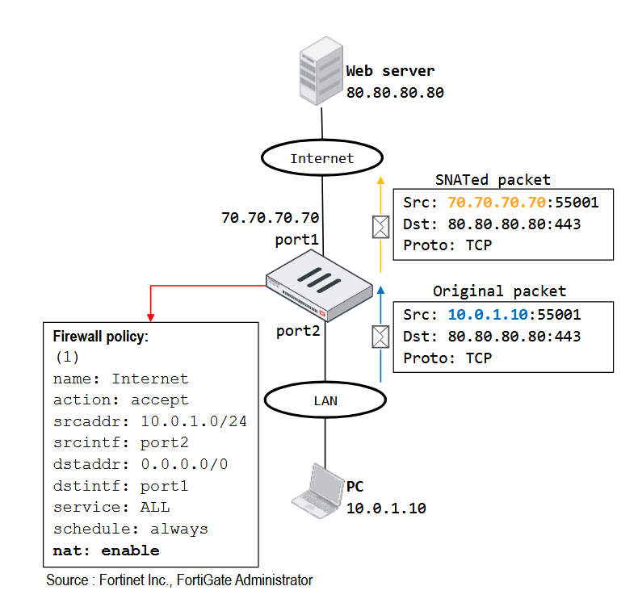

- ### Deux méthodes de configuration de la NAT
  - **Firewall Policy NAT mode**
    - **SNAT et DNAT doivent être configurés pour chaque règle de pare-feu**
      - SNAT utilise l'adresse de l'interface de sortie ou le pool IP configuré.
      - DNAT utilise l'adresse IP virtuelle (VIP) configurée comme adresse de destination.
    - **Méthode utilisée dans les petits réseaux**
      - Dans lesquels il y a peu de NAT et chaque IP NAT est associée à des politiques et des profils de sécurité distincts.
    - **Central NAT mode**
      - **Permet la création de plusieurs règles NAT centralisées**
        - Les règles sont lues dans l'ordre jusqu'à trouver une correspondance.
        - Configuration par VDOM.
      - **Permet de définir et de contrôler la traduction d'adresse avec plus de précision**
        - Par exemple, il est possible de contrôler la traduction des ports, plutôt que de laisse l'UTM choisir automatiquement.
      - **Utile dans les réseaux plus complexes avec de nombreuses règles de pare-feu devant réaliser du NAPT**

# Firewall Policy NAT

- ### SNAT en utilisant l'interface de sortie
  - **Outgoing interface (interface de sortie)**
    - Remplace l'adresse IP source par l'adresse de l'interface de sortie.
    - Le PAT est activé (NAT Overload).
  - **Preserve source port :**
    - Désactive la traduction de port.
    - Une seule connexion possible pour un même N° de port source.

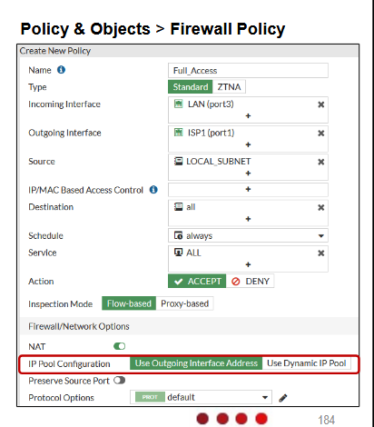

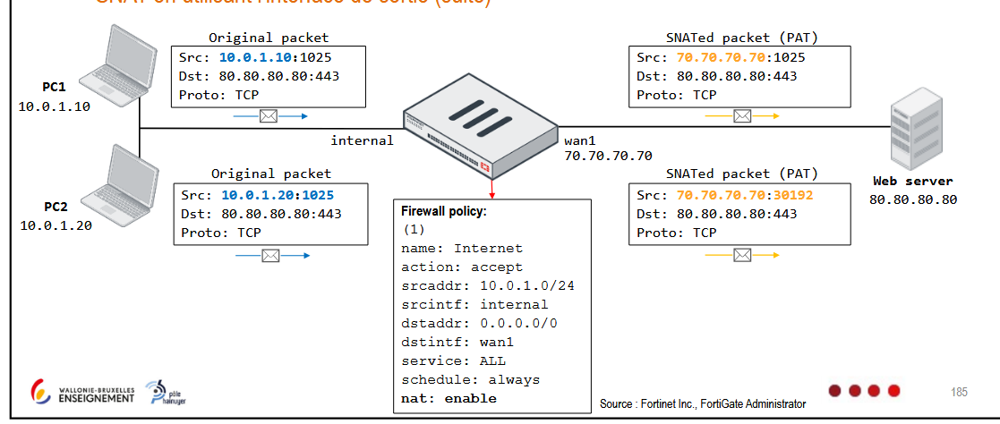

- ### SNAT en utilisant un pool d'adresses IP (IP pool)
  - 1. **IP pool type : Overload**
    - Le NAT utilise les adresses du pool plutôt que l'adresse de l'interface de sortie.
    - Par défaut, le pool est de type overload (PAT).
  - 2. **IP pool type : One-to-one**
    - **Correspond au NAT dynamique**
      - Translation d'une adresse IP source vers la première IP disponible du pool NAT.
      - Premier arrivé, premier servi. Plus d'adresse dans le pool, plus de nouvelles communications possibles.
    - **La translation de port est désactivée**
      - Pas de PAT, le port source est conservé.
      - S'il n'y a plus d'IP disponibles dans le pool, la connexion est réfusée.

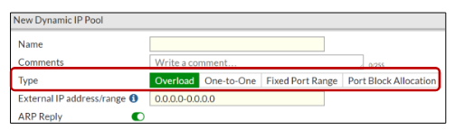

- ### Carrier-Grade NAT
  - NAT utilisés par les fournisseurs d'accès à internet (FAI) pour gérer la pénurie d'adresses IPv4.
  - **Principe**
    - Le routeur du client effectue une première traduction NAT.
    - Quand les données atteignent le réseau du FAI, le CGN traduit l'adresse IP privée du client (déjà traduite une première fois par le routeur local) en une adresse IP publique partagée.
    - Chaque connexion est associée à un port source unique, pour différencier les sessions de différents clients partageant la même adresse publique.
  - **Deux types :**
    - IP pool type : Fixed port range
    - IP pool type : Port block allocation

- ### Virtual IP (VIP)
  - **Objets utilisés pour faire de la DNAT (si pas de Central NAT)**
    - Permet de mapper une adresse IP externe à une adresse IP interne (trafic entrant, généralement vers un serveur interne).
  - **Par défaut, le type de VIP est NAT statique (One-to-one mapping)**
    - **Pour le trafic entrnant correspondant à une VIP**
      - Càd à destination de l’adresse « externe » définie dans la VIP (ici 100.64.100.22), peu importe le protocole et le port utilisé.
      - Cette adresse de destination (100.64.100.22) est traduite, le FW la remplacera par l'adresse définie dans l'objet VIP (ici 10.0.1.10).
    - **Pour le trafic sortant dont l'IP source est définie dans la VIP (ici 10.0.1.10) :**
      - Le FW remplacera cette adresse source par l'adresse externe définie dans l'objet VIP (100.64.100.22) si la NAT est activée dans la règle de FW.
      - Ce comportement par défaut peut être modifié.


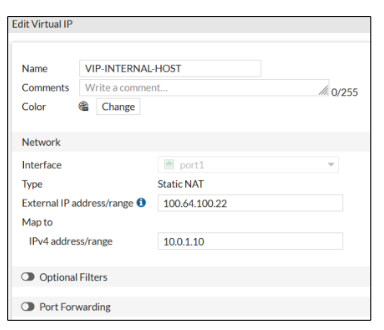

- ### Virtual IP (VIP)
  - **Port Forwarding (One-to-one mapping désactivé)**
    - Avec Port Forwarding, vous pouvez réutiliser la même adresse externe et la mappar à différentes adresses et ports internes.
  - **FQDN est un autre type de VIP**
    - Permet de configurer les objets d'adresse FQDN en tant qu'adresses IP externes et internes.
      - Dans les environnement de cloud public, il est parfois nécessaire de mapper un VIP à une adresse FQDN.
  - **Routage**
    - Les VIP doivent être routables vers l'interface externe.
    - Par défaut, FortiOS répond aux requêtes ARP pour les VIP ou les pool IP.
  - **Balancement de charge possible**
    - Si plusieurs serveurs internes sont accessibles depuis la même IP externe.

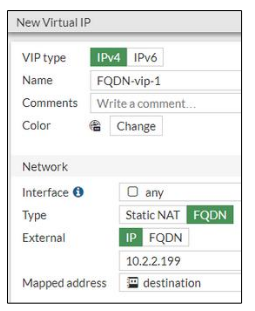

- ### VIP de type NAT Statique (trafic entrant)

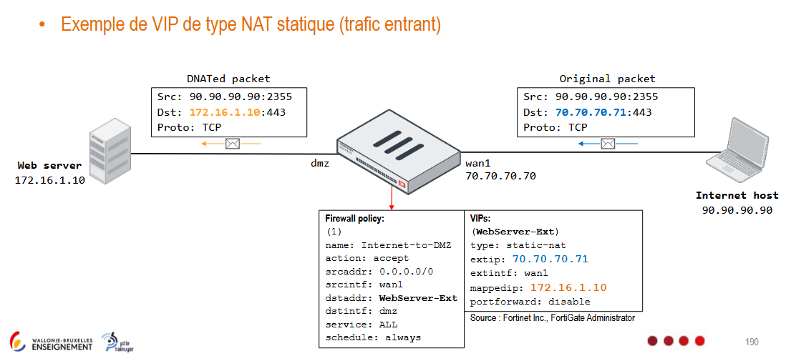

- ### VIP de type NAT Statique (trafic sortant)

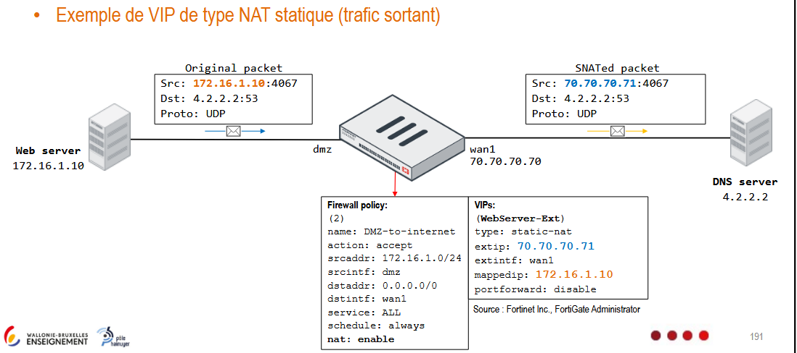

- ### VIP de type *port forwarding*

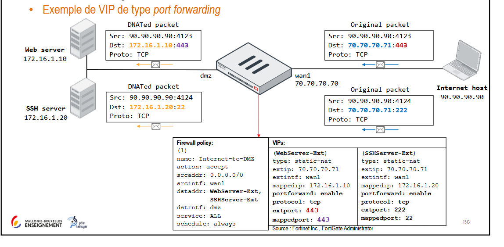

- ### Redirection de port (Port forwading)
  - **Exemple de création d'une VIP pour faire du Port Forwarding**
    - Avec le Port Forwarding, vous pouvez réutiliser la même adresse externe et la mapper à différentes adresses et ports internes (One-to-one mapping désactivé).


- ### Règles de pare-feu et Virtual IP
  - **Par défaut, les objets d'adresse matchent les VIP**
    - Les VIP et les objets d'adresses de pare-feu sont des objets de types différents.
    - À partir de la version FortiOS 7.2.4, le paramètre *match-vip* est activé par défaut pour les règles de pare-feu dont l'action est "deny" et permet aux objets d'adresse du pare-feu de correspondre aux VIP.
      - => Par défaut, l'objet adresse "ALL" d'une règle de pare-feu inclut les VIP.

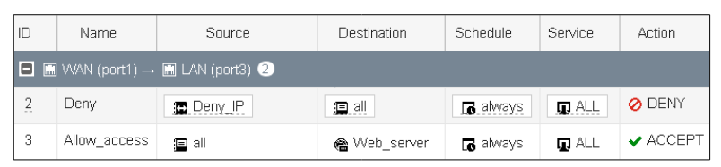

  - **Solution si ``match-vip disable``**
    - Permettre aux objets d'adresses de correspondre à l'adresse VIP en activant l'option "match-vip" en CLI.
    - 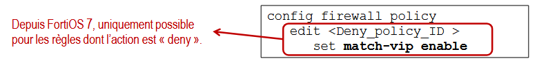
  - **Solution 2 si ``match-vip disable``**
    - Utiliser l'adresse VIP dans la règle de pare-feu.
    - 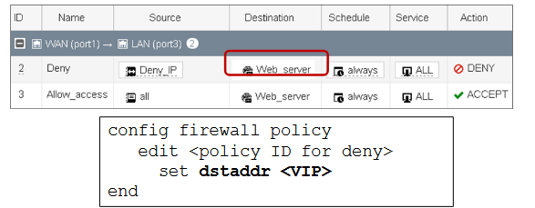

