# Compléxité des Données

***Données simples :*** 0 ou 1, allumé ou éteint, présent ou absent...

***Données complexes :*** distance, température, accélération

Possibilité pour traiter des données complexes :

- Passer en transmission binaire, mais ça prend trop de lignes

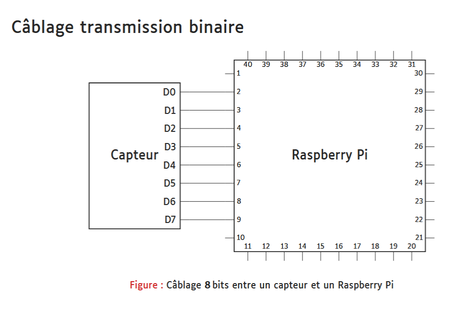

- Problème avec ceci : 
  - 1 capteur => 8 lignes de communication
  - 2 capteurs => 16 lignes
  - 3 capteur => 24 lignes
  - ...

___

Donc plutôt qu'utiliser un fil pour chaque bit qu'on veut transmettre.
On va trouver une manière de raccorder plusieurs composants sur le même fil.

Solution -> **Un bus de données**

- C'est un ensemble de lignes de communication permettant l'échange de données entre plusieurs composants d'un système informatique.

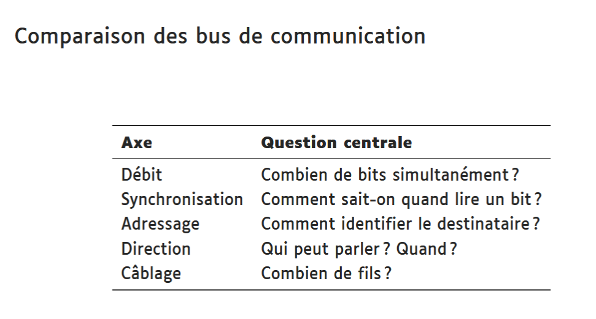

___

### *Différents Bus*

**Bus parallèle**

- Bus qui transmet plusieurs bits simultanément sur plusieurs lignes de communication.
- Exemples : 
  - bus entre CPU et la RAM d'un ordi.
  - **Schéma :**
    - 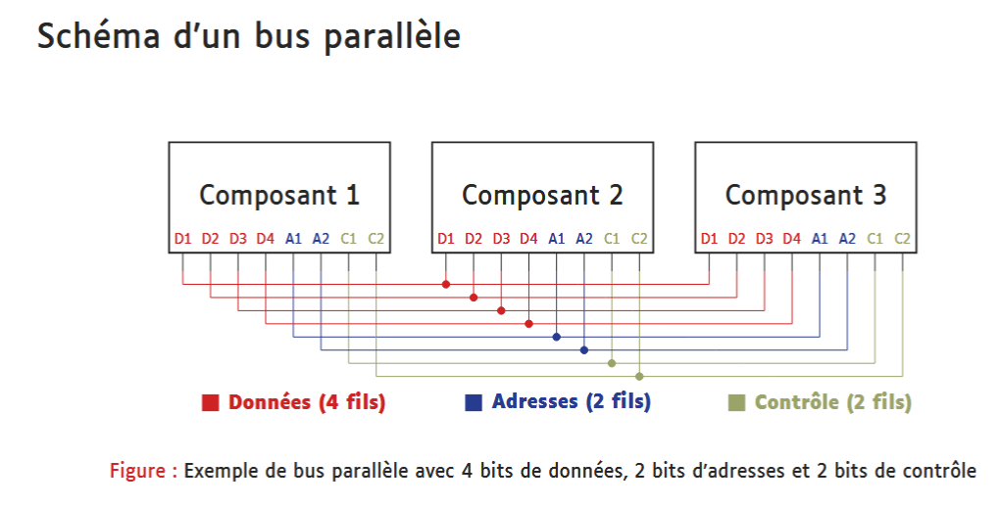

**Limites physiques :**

- Nombre de lignes de communication.
- Interférences électromagnétiques à haute fréquence.
- Longueur identique des lignes de communication.

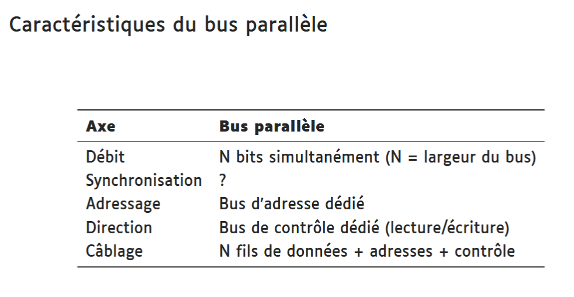

(Pas la meilleure solution non plus)

PCI (exemple de bus parallèle)
___

**Bus série (UART)**

PCIe (exemple de bus série x2/x4/x8/x16, bus de série mis en même temps)

- Bus qui transmet les données bit par bit sur une seule ligne de communication.

- Exemples :
  - USB, SATA, PCIe, i²c, SPI, UART.

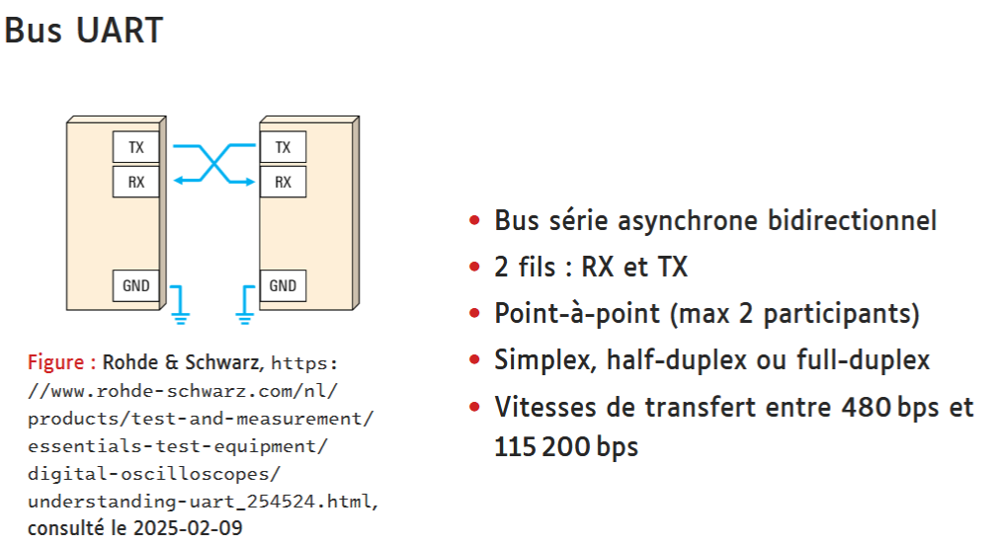

- simplex : un qui transmet un qui reçoit, vont dans un seul sens.
  - Un appareil transmet.
  - l'autre reçoit.
  - pas de retour possible
- Exemple :
  - Clavier -> PC
  - TV (antenne -> TV)

- half-duplex : communication dans les deux sens, mais pas en même temps.
  - Chaque appareil peut : 
    - Transmettre
    - Recevoir
  - Mais pas simultanément.
- Exemple :
  - Talkie-Walkie

- full-duplex : communication dans les deux sens en même temps.
  - Chaque appareil peut :
    - Transmettre
    - Recevoir
    - Simultanément.
  - Exemple :
    - Téléphone
    - Réseau Ethernet moderne (switché)

**Problème du UART**

- **Configuration**

  - À choisir : 
    - **Vitesse de transmission** baud rate = vitesse de transmission des signaux (pas en mesure de décoder le message reçue si pas configuré)
    - **Nombre de bits de données** de 5 à 9 (bus en série 1 par 1, faut savoir quand on a transmit le bit de donnée)
    - **Bit de parité** aucun (N), pair (E) ou impair (O) = détection d'erreur
    - **Nombre de bits de STOP 1 ou 2**
  - 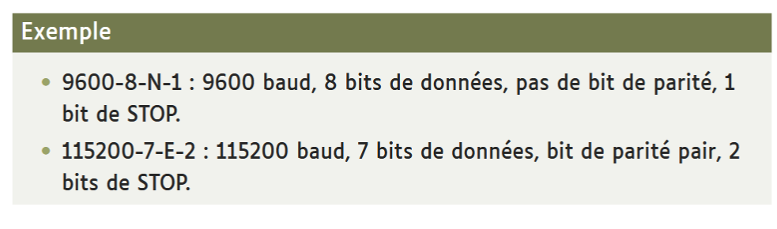

**Codage de données**

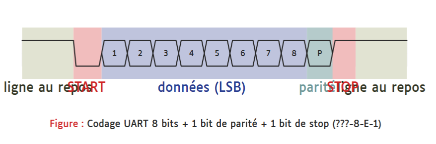

*Bit poids faible et fort :*

- Exemple : 1011 -> (1 - fort)01(1 - faible)

**/!\ UART commence par le bit de point faible.**

- Donc de droite vers la gauche.

*Le bit de parité (en vert sur le schéma)*

*Pour signifier STOP, donc bit de STOP, état haut*

___

**Signaux**

Faut maintenant transformer des bits (0 et 1) en signaux électriques.

*Plusieurs standards courants :*

- **TTL** standard pour les communications série sur des courtes distances :
  - 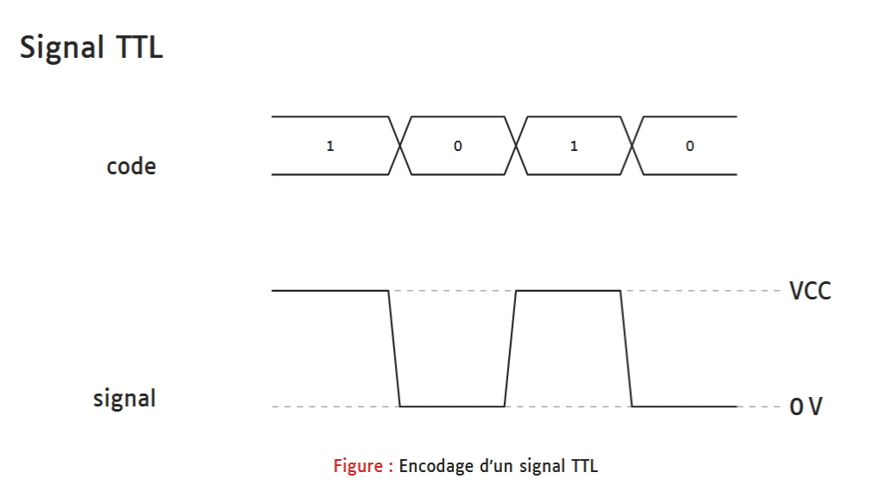
  - État haut déterminé, comme pour RPI3 à 3.3V et état bas à 0V.

- **RS-232** standard historique pour les communications série :
  - 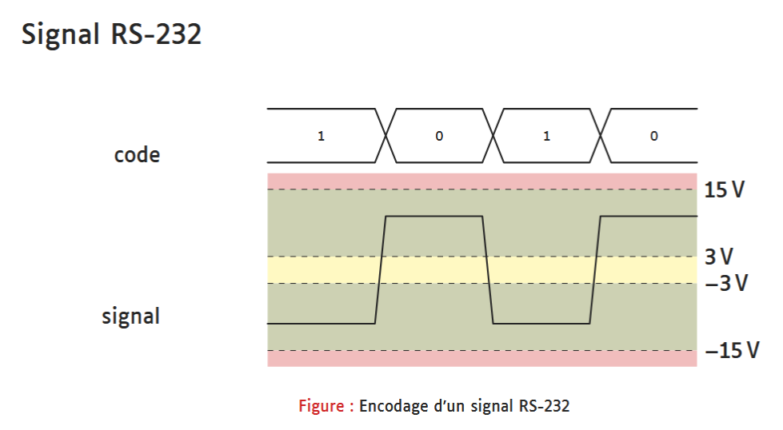
  - À l'état bas on ne sait pas où on se retrouve entre -15V et -3V.

- **RS-485** standard pour les communications série en réseau :
  - 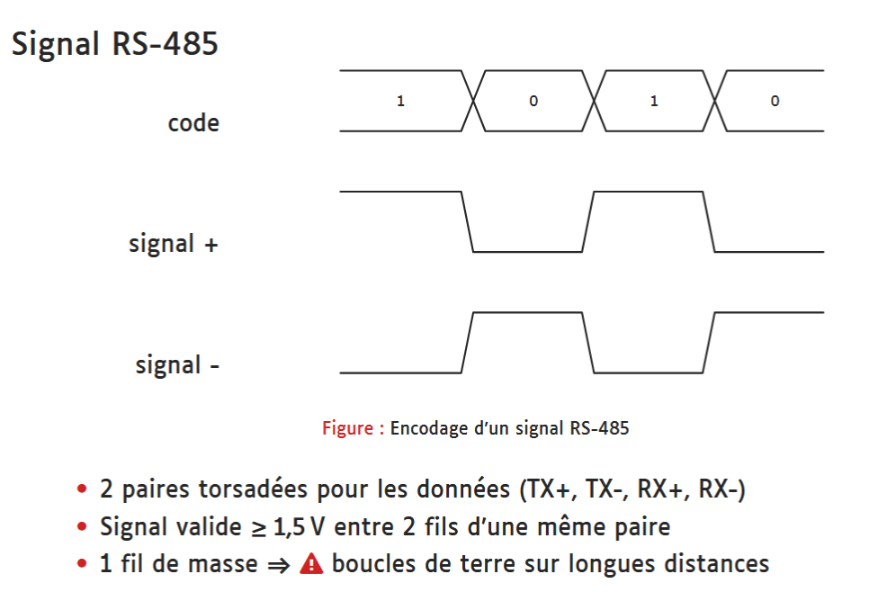
  - Avantage de traverser des distances plus longues (câblage en série sur des longues distances).
  - Plus important : pas savoir la tension d'un fil, mais est-ce que c'est le fil + qui a une tension plus elevé que le fil - ou l'inverse. Pour ceci qu'ils se croisent.

**Exercice :**

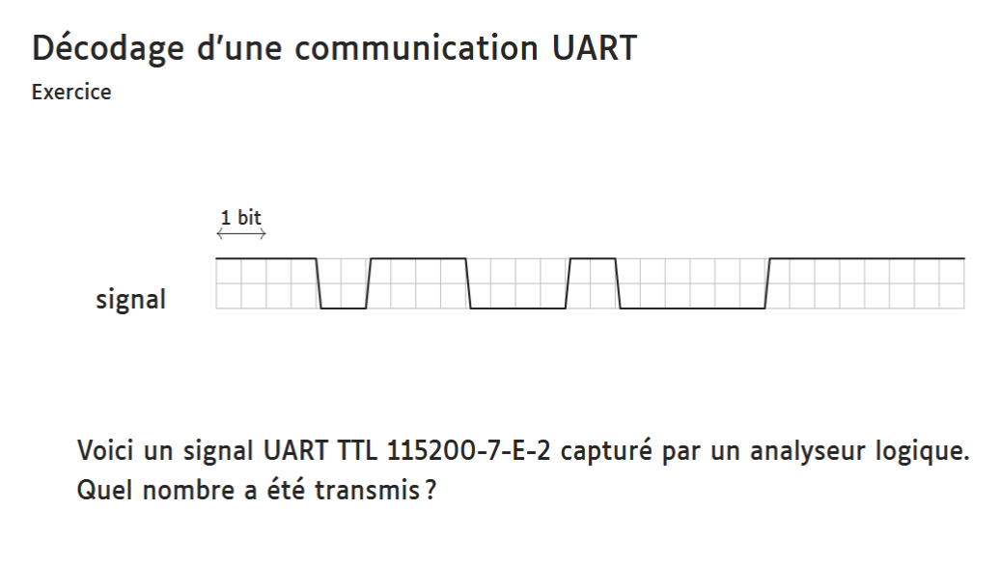

11|0|1100100|0|11|11 -> faut lire à partir du premier passage à état bas (bit de START), puis les 7 bits qui suivent, puis bit de parité, puis 2 bits de STOP.
   

1100100 - 100 (puis on inverse, lecture de droite à gauche)

0010011 - 19

- Dans ce cas ci on s'en fou des états (**TTL**, juste besoin de lire le signal tranquillement), mais en **RS-232** on inverse les états.
- En **RS-485** on est obligé d'avoir l'info des signaux, lequel est positif lequel est négatif on aura 2 signaux du coup.

Correction : 

- Correction à faire PLEAAAAASE. (sur paint ou quoi bg)

- Parité en E (Ici il sera à 0 car 3x1 bits).
- Si le nombre transmit (donc les 7 bits lus) a un nombre de 1 impair le bit E sera 0, si le nombre de 1 est pair alors le E sera 1.

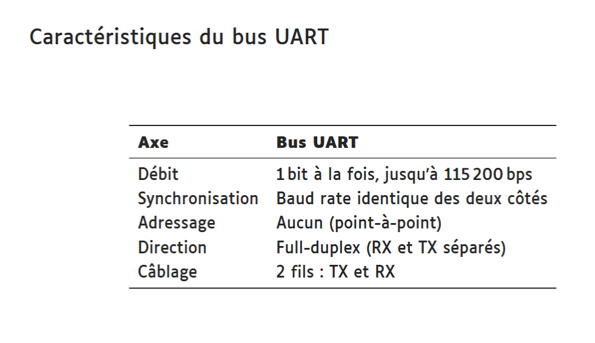

___

### Et si on veut plusieurs destinataires ?

Problème -> UART est limité à *2 participants*.

Pour connecter plusieurs composants sur le même bus, il faut : *Horloge commune* pour synchroniser les participants *adresses* pour identifier le destinataire

-> Solution -> **Bus i²c**

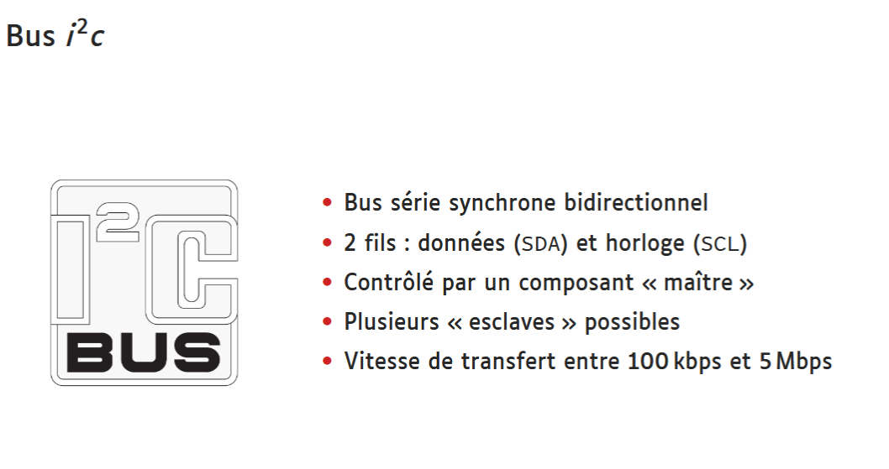

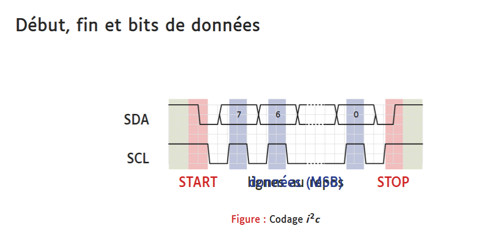

**Signal d'horloge** -> SCL en haut, c'est quand on va s'intéresser. Uniquement quand SCL est en haut.

**/!\ Pour i²c on commence par le bit poids fort**

- C'est le **Signal d'horloge** qui va donner les informations aux composants. Ils auront tous adapté cette configuration là.

**Exemple :**

- 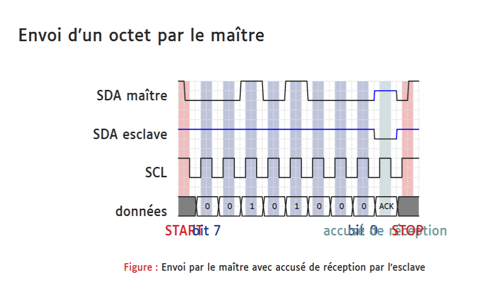

- Quand c'est en bleu le maître impose à l'esclave.
- Le SDA maître pour le ACK, va envoyer un signal bleu vers le haut, et l'esclave va le tirer vers le bas pour dire qu'il est bien reçu.
- C'est le SDA maître aussi qui va dire le STOP.

#### Ecriture d'un octet
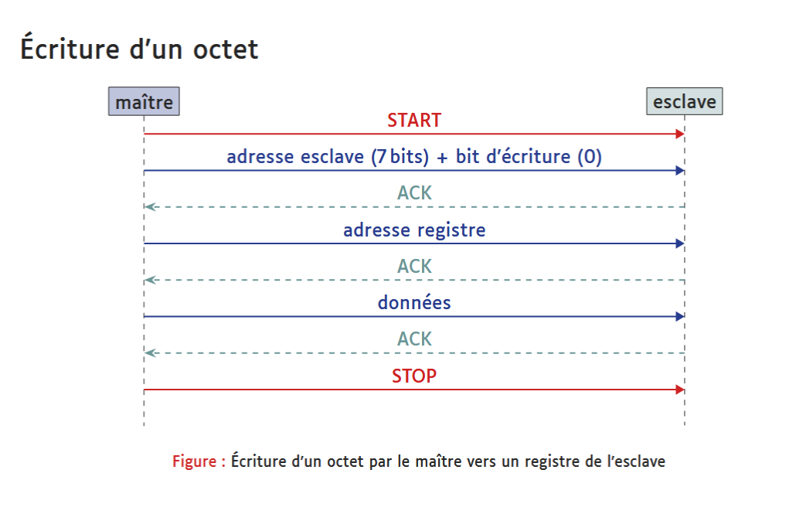

#### Lecture d'un octet
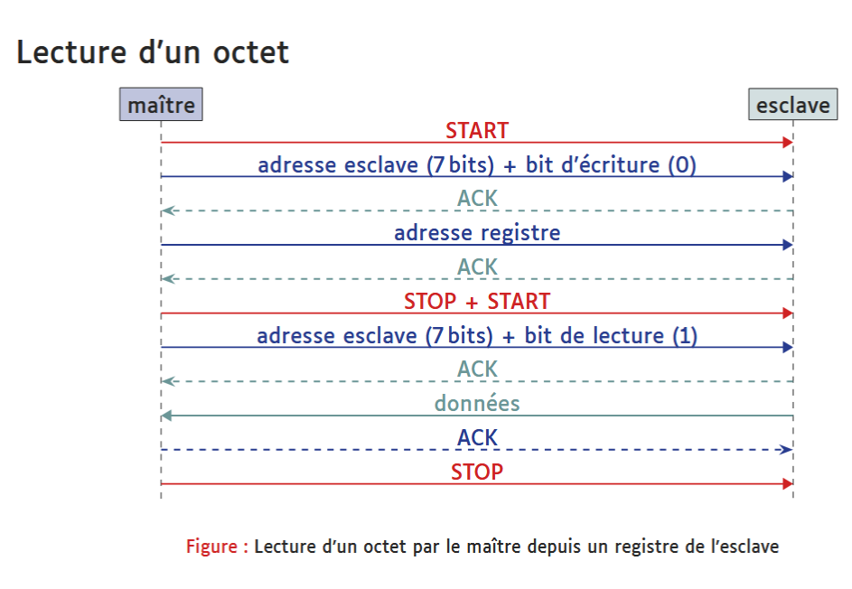

#### Résumé de la structure des communications

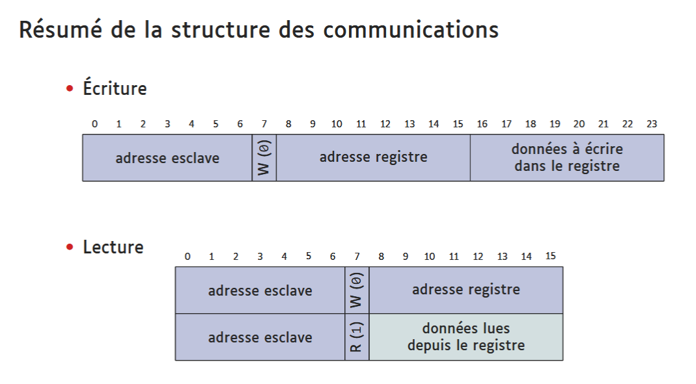

#### Exercice :

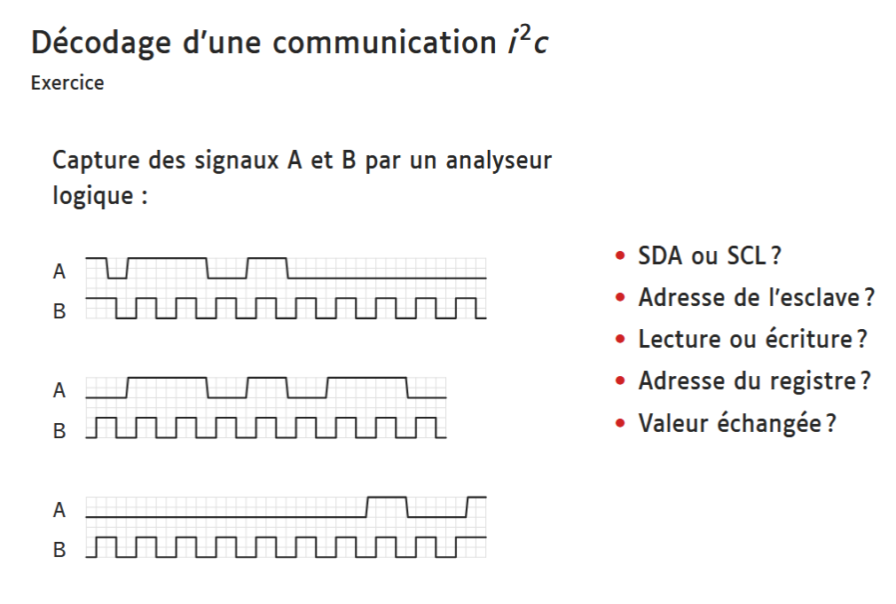

À REVOIR - PAS LE TEMPS DE CORRECTION.

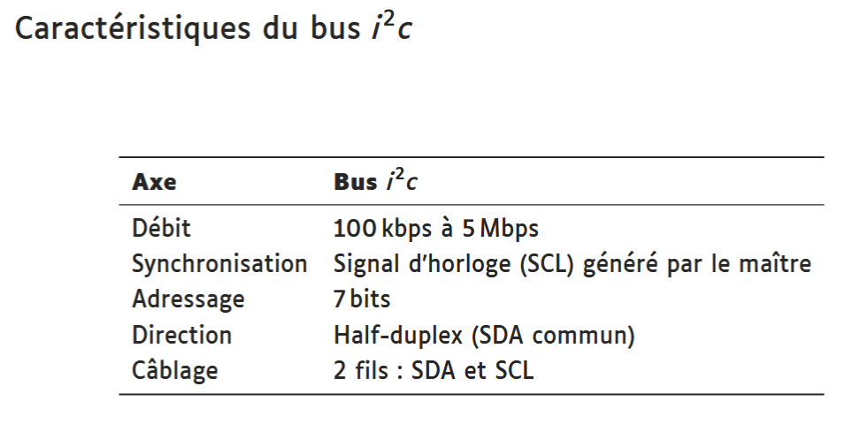

#### Conclusion

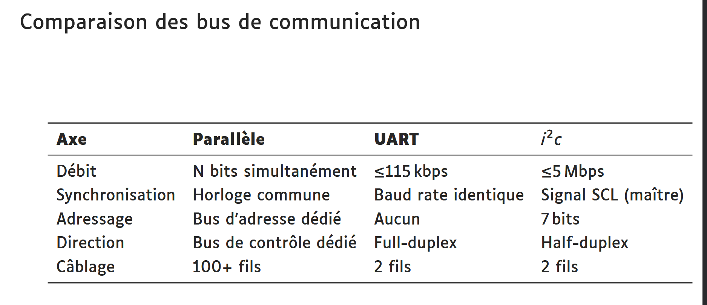

#### Quel bus choisir ?

- **UART** communication point-à-point simple.
- **i²c** plusieurs capteurs sur le même bus

Souvent le choix est imposé par les composants que l'on utilise.

#### Et SPI ? (capteur dont on a pas parler)

 - Plus rapide que i²c.
 - Sans adressage natif, nécessite un fil de sélection pour chaque escale.
 - Full-duplex
___

