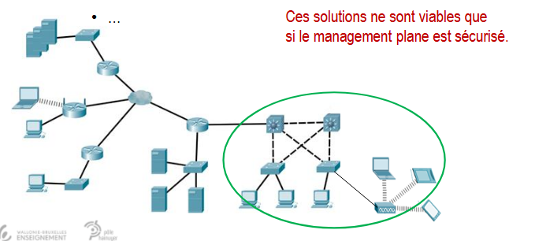

# Chapitre 10 - Sécurité de couche 2

## Plans fonctionnels d'un réseau

### - Sécurisation du data plane
- **Principale mesures de sécurité**
  - Sécurité L2 : port security, DHCP snooping, BPDU gard, ...
  - ACL
  - IPS
  - Firewall
  - ...



## Menaces Courantes sur la couche 2

### - Attaque de la table de commutation
- **MAC address flooding -> CAM overflow**
  - Envoi de nombreuses trames afin de saturer de la table de commutation.
  - Une fois saturée de fausses adresses,
    - Aucune nouvelle entrée n'est possible (tant que l'attaque continue).
    - Le commutatuer diffuse dans le VLAN (donc aussi vers l'attaquant).
  - **Solutions**
    - Les adresses MAC apprises par le commutateur peuvent être vérifiées sur un serveur AAA.
    - Configurer les ports d'extrémités afin de limiter le nombre d'adresses qui peuvent être apprises sur les ports.

```bash
S(config-if)# switchport mode access
S(config-if)# switchport port-security
S(config-if)# switchport port-security maximum 11
S(config-if)# switchport port-security violation restrict
```

### - Port Security aging
- Permet de retirer des adresses associées à un port sécurisé.

``Sw(config-if)# switchport port-security aging [static |time time
|type {absolute | inactivity}}``

- Description
  - Static :active le port security aging pour les adresses configurées manuellement.
  - Time : de 0 à 1440 min (24h). 0 désactive le port security aging.
  - Absolute : l'adresse sécurisée est supprimée après un temps défini.
  - Inactivity : l'adresse sécurisée est supprimée après un temps défini d'inactivité
